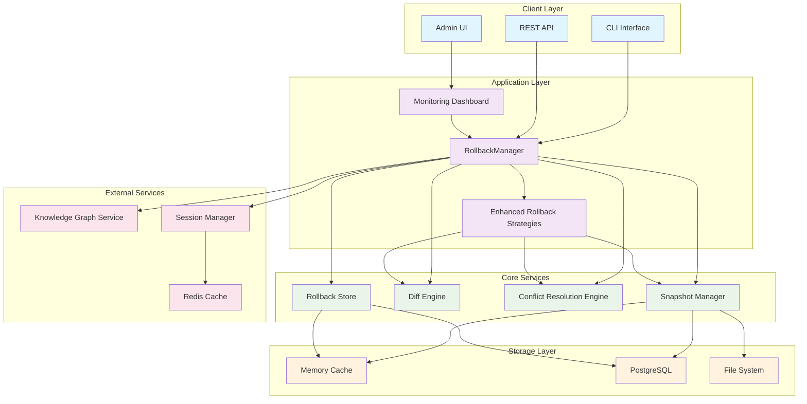
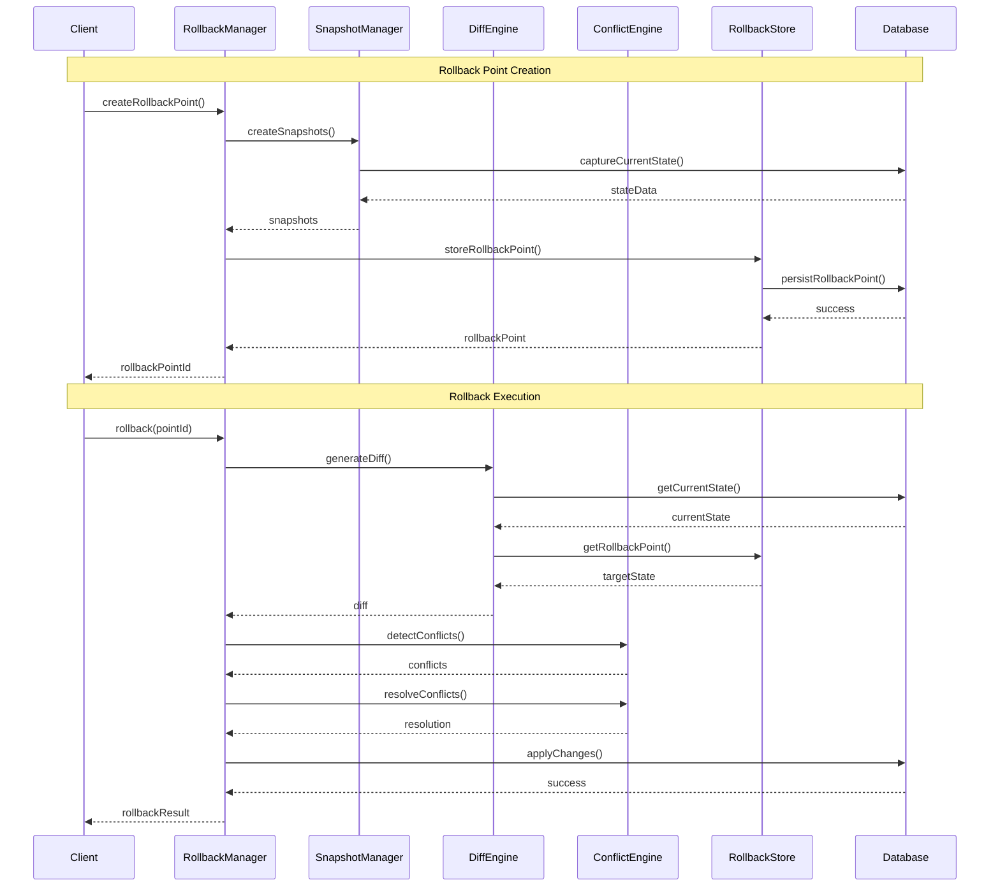
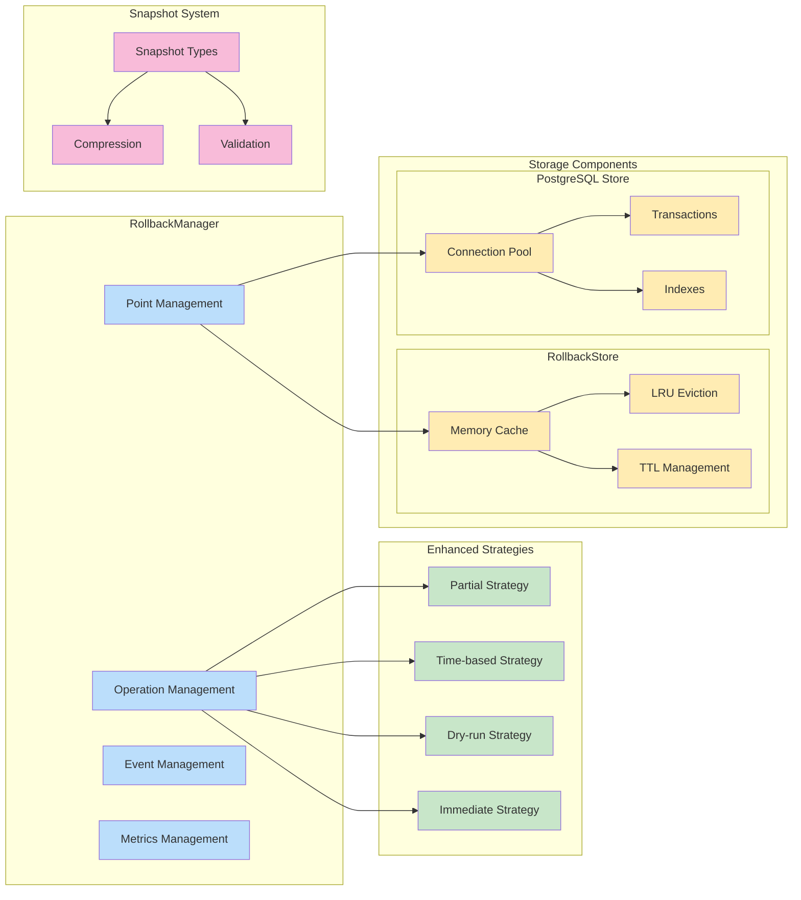
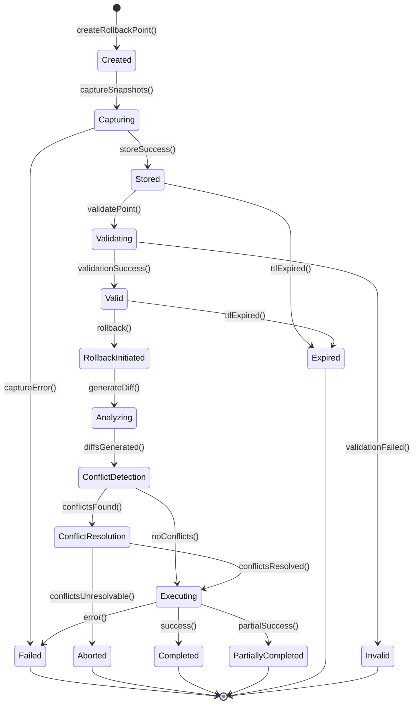
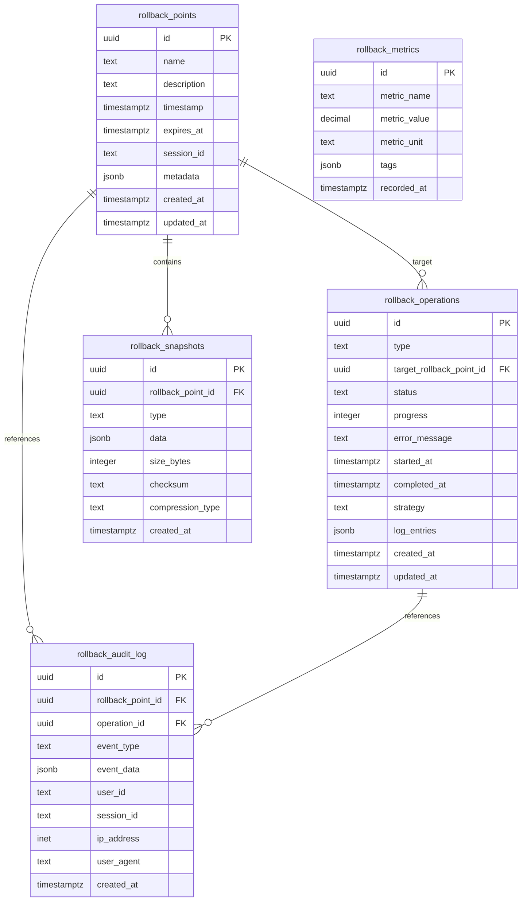
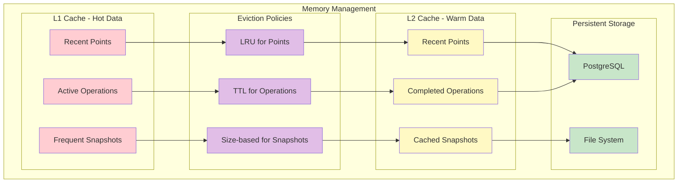
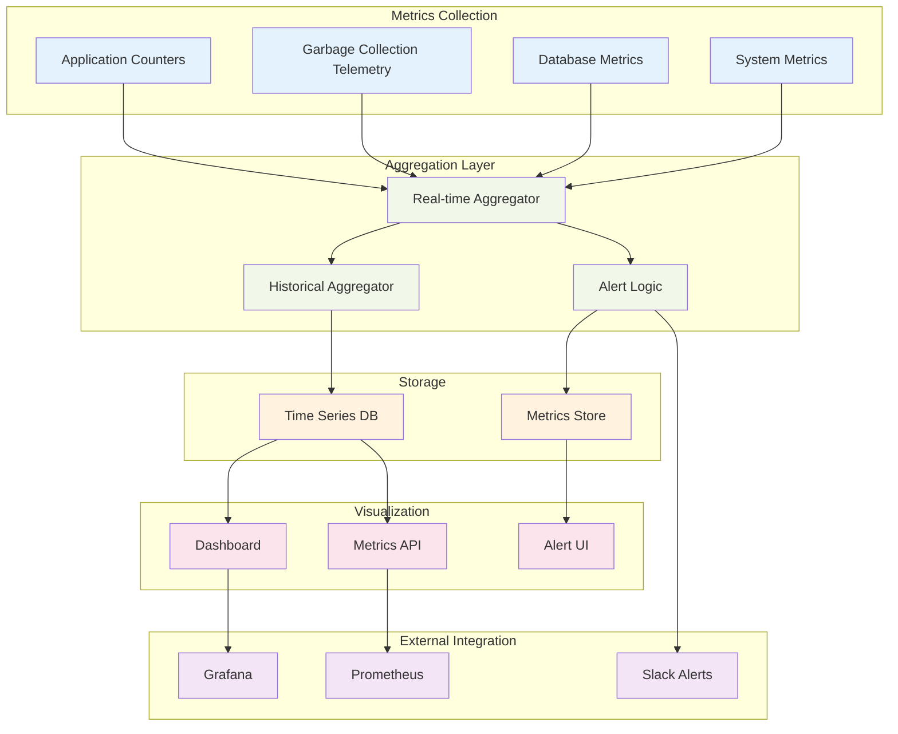
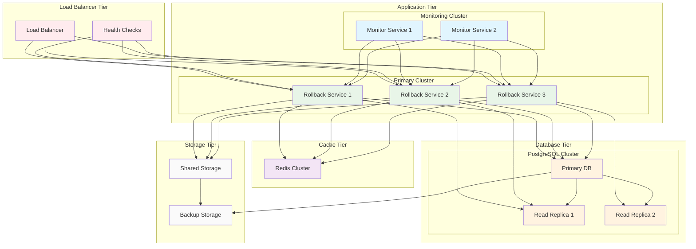
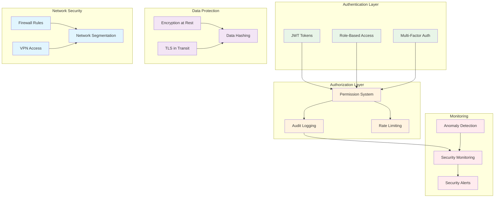

# Rollback Capabilities Architecture Diagrams

## Metadata

- Scope: rollback
- Status: Draft
- Last Updated: 2025-09-27

## Working TODO

- [ ] Add/update Scope metadata (Scope: rollback).
- [ ] Confirm Desired Capabilities with acceptance tests.
- [ ] Link to code touchpoints (packages/, api routes).
- [ ] Add migration/backfill plan if needed.

## Desired Capabilities

- [ ] Define required capabilities and acceptance criteria.
- [ ] Note API/Graph impacts.

## Overview

_Concise purpose, target outcomes, and context._

## System Overview



## Data Flow Architecture



## Component Architecture



## State Transition Diagram



## Database Schema Diagram



## Memory Management Architecture



## Conflict Resolution Flow

```mermaid
flowchart TD
    Start([Rollback Initiated]) --> DetectConflicts[Detect Conflicts]

    DetectConflicts --> HasConflicts{Conflicts Found?}

    HasConflicts -->|No| DirectApply[Apply Changes Directly]
    HasConflicts -->|Yes| AnalyzeConflicts[Analyze Conflict Types]

    AnalyzeConflicts --> ConflictType{Conflict Type}

    ConflictType -->|Value Mismatch| ValueResolution[Value Conflict Resolution]
    ConflictType -->|Type Mismatch| TypeResolution[Type Conflict Resolution]
    ConflictType -->|Structure Change| StructureResolution[Structure Conflict Resolution]
    ConflictType -->|Dependency| DependencyResolution[Dependency Conflict Resolution]

    ValueResolution --> Strategy{Resolution Strategy}
    TypeResolution --> Strategy
    StructureResolution --> Strategy
    DependencyResolution --> Strategy

    Strategy -->|Abort| Abort[Abort Rollback]
    Strategy -->|Skip| SkipConflicts[Skip Conflicted Items]
    Strategy -->|Overwrite| OverwriteChanges[Overwrite Current]
    Strategy -->|Manual| ManualResolution[Request Manual Resolution]
    Strategy -->|Merge| SmartMerge[Attempt Smart Merge]

    SkipConflicts --> PartialApply[Apply Non-conflicted Changes]
    OverwriteChanges --> DirectApply
    SmartMerge --> MergeSuccess{Merge Successful?}

    MergeSuccess -->|Yes| DirectApply
    MergeSuccess -->|No| ManualResolution

    DirectApply --> Success[Rollback Complete]
    PartialApply --> PartialSuccess[Partial Rollback Complete]
    Abort --> Failed[Rollback Failed]
    ManualResolution --> Pending[Awaiting Manual Resolution]

    Success --> End([End])
    PartialSuccess --> End
    Failed --> End
    Pending --> End

    classDef start fill:#a5d6a7
    classDef decision fill:#ffb74d
    classDef process fill:#81c784
    classDef resolution fill:#ba68c8
    classDef end fill:#ef5350

    class Start start
    class HasConflicts,ConflictType,Strategy,MergeSuccess decision
    class DetectConflicts,AnalyzeConflicts,DirectApply,PartialApply process
    class ValueResolution,TypeResolution,StructureResolution,DependencyResolution,SkipConflicts,OverwriteChanges,SmartMerge,ManualResolution resolution
    class Success,PartialSuccess,Failed,Pending,Abort,End end
```

## Performance Monitoring Architecture



## Deployment Architecture



## Security Architecture



---

*These architecture diagrams provide a comprehensive view of the rollback capabilities system design, from high-level component interactions to detailed database schemas and deployment considerations.*